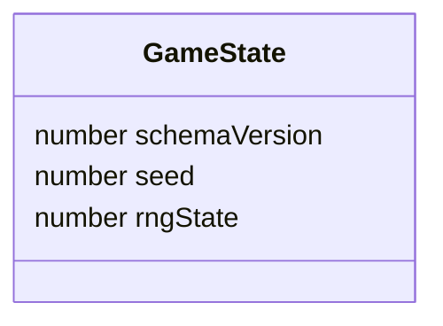

# core

Owns game state and rules. It has no DOM dependency and takes randomness only from `nextRandom`.

```mermaid
classDiagram
  class GameState {
    number schemaVersion
    number seed
    number rngState
  }
```

Implements the `UC-CORE-*` use cases in `docs/architecture.md`. All are planned.
